# Awesome Cloud Security, Compliance & Trust Center 🛡️ ✅

  

  
  
  
  
  
  

---

## 🌟 Top Cloud Security, Compliance & Trust Center Ecosystem 🚀

**Curated Directory of Commercial Trust Platforms, Open-Source GRC Tools & Cloud Compliance Engines** 🛡️  
*Focused on SOC 2 / ISO 27001 Automation, Security Questionnaire AI, Evidence Collection, Continuous Compliance Monitoring & Self-Hosted Trust Portals.*

**Last updated: October 2026** 📅

---

### 📌 Overview & SEO Summary 🔍

Welcome to the ultimate curated resource for **cloud security**, **compliance automation**, **trust center portals**, **Governance, Risk & Compliance (GRC)**, and **security questionnaire response frameworks**. 

Modern cloud security posture management (CSPM) and sales enablement require transparent, automated trust centers and continuous audit readiness. This directory benchmarks market leaders across two key operational categories:
1. **Commercial SaaS Trust Platforms** (such as *Vanta*, *Drata*, *SafeBase*, *Conveyor*, and hyperscaler hubs).
2. **Open-Source Compliance & Security Repositories** (such as *Prowler*, *Steampipe*, *Cloud Custodian*, *DefectDojo*, *CISO Assistant*, and *Probo*).

---

## 📑 Table of Contents 📖

- [🏢 SaaS & Commercial Platforms](#-saas--commercial-platforms)
- [🔓 Open-Source GitHub Projects](#-open-source-github-projects)
- [🛠️ How to Contribute](#%EF%B8%8F-how-to-contribute)
- [📊 Star History](#-star-history)
- [🤝 Support & Sponsorship](#-support--sponsorship)
- [⚠️ Disclaimer](#%EF%B8%8F-disclaimer)

---

## 🏢 SaaS & Commercial Platforms 💼

📈 **Market Size & Sector Structure:** The global Cloud Security, Compliance & Trust Center software market is estimated at **$14.2 Billion in 2026** (growing at a **21.5% CAGR**). The market is **moderately fragmented**: cloud hyperscalers (AWS, Microsoft, GCP) dominate infrastructure-native trust portals; legacy enterprise GRC is anchored by OneTrust and ServiceNow; while high-growth mid-market platforms (Vanta, Drata, SafeBase, Conveyor) compete fiercely for automated SOC 2/ISO 27001 evidence collection, AI questionnaire answering, and buyer-facing trust centers without a single winner-take-all monopoly.

*Sorted by Company Size / Valuation (Descending)* 📉

| SaaS / Commercial Platform | Company / Owner | Company Size / Valuation 💰 | Starting Tier Price 🏷️ | Free Tier / Free Trial Limits 🎁 | Key Features & Description ℹ️ |
| :--- | :--- | :--- | :--- | :--- | :--- |
| **[Microsoft Trust Center](https://www.microsoft.com/en-us/trust-center)** 🔷 | Microsoft Corporation | **~$3.90 Trillion** (Market Cap) | **Free service** ($0/year for Azure & M365 account holders) | **Free forever** (Unlimited access to Service Trust Portal, ISO/SOC audit reports, and compliance documentation) | **Microsoft-native trust portal** — Trust spans responsible AI, SOC 1/2/3, ISO/IEC compliance, and privacy controls across Azure, M365, and Dynamics 365. 🌐 |
| **[AWS Trust Center](https://aws.amazon.com/security/trust-center/)** ☁️ | Amazon.com, Inc. | **~$2.00 Trillion** (Market Cap) | **Free service** ($0/year for AWS account holders) | **Free forever** (Unlimited access to compliance artifacts, AWS Artifact, and operator security whitepapers) | **AWS-native security & compliance hub** — Central resource for AWS security practices, compliance programs, zero-access designs, and automated compliance reports. 🔒 |
| **[Google Cloud Trust Center](https://cloud.google.com/trust-center)** 🌐 | Alphabet Inc. | **~$2.00 Trillion** (Market Cap) | **Free service** ($0/year for GCP account holders) | **Free forever** (Unlimited on-demand access to Compliance Reports Manager, ISO 27001/27017/27018, and FedRAMP certificates) | **GCP-native trust platform** — Comprehensive compliance repository covering Google Cloud & Workspace security controls and transparency reports. 🛡️ |
| **[OneTrust](https://www.onetrust.com/)** 🏢 | OneTrust Inc. | **~$4.50 Billion** (Valuation) | **$50,000/year** (Mid-market Privacy & GRC starting tier + 20–40% onboarding fee) | **Free trial**: 14-day full platform access (Limited to 5 admin seats and sample assessment templates) | **Enterprise Privacy & GRC Platform** — Vendor risk management, third-party risk management (TPRM), data governance, and automated regulatory compliance. 🏛️ |
| **[Drata](https://drata.com/)** 🔵 | Drata Inc. | **~$2.00 Billion** (Valuation) | **$25,000/year** (Foundation plan; includes Trust Center Standard) | **Free trial**: 14-day guided proof-of-concept (Includes 3 automated integrations and audit readiness scan) | **Continuous compliance automation** — Real-time security posture monitoring, automated evidence collection, and integrated buyer-facing Trust Center. ⚡ |
| **[Vanta](https://www.vanta.com/)** 🟢 | Vanta Inc. | **~$1.60 Billion** (Valuation) | **$10,000/year** (Base SOC 2 framework) + **$4,000/year** (Trust Center add-on) | **Free trial**: 7-day interactive sandbox demo (Pre-populated compliance dashboards and policy templates) | **Agentic trust platform** — SOC 2, ISO 27001, HIPAA, and GDPR automation with AI chatbot for buyer security reviews and bi-directional CRM sync. 🤖 |
| **[SafeBase](https://safebase.io/)** 🛡️ | SafeBase Inc. | **~$250 Million** (Valuation) | **$12,000/year** (Growth tier starting price) | **Free tier**: Foundation Plan free forever (1 public Trust Center, 10 document requests/mo, manual NDA workflows) | **Buyer-centric trust center platform** — Streamlines security reviews, automates NDA execution, and integrates with Salesforce/HubSpot to accelerate sales velocity. 🚀 |
| **[Whistic](https://www.whistic.com/)** 🔍 | Whistic Inc. | **~$100 Million** (Valuation) | **$15,000/year** (Standard Vendor Risk & Profile tier) | **Free trial**: 14-day vendor trial (Includes 5 profile shares and basic questionnaire auto-fill) | **Third-Party Risk Management (TPRM)** — Dual-sided trust network allowing vendors to publish proactive Security Profiles and buyers to automate questionnaires. 📊 |
| **[Tugboat Logic](https://www.onetrust.com/)** 🚤 | OneTrust (Startup Division) | **~$100 Million** (Valuation) | **$45/month** ($540/year Essentials starting tier) | **Free trial**: 14-day free trial (Includes 10 core policy templates and 24 essential compliance controls) | **Security assurance for startups** — Guided compliance roadmap for emerging companies seeking fast SOC 2 or ISO 27001 readiness. ⛵ |
| **[Conveyor](https://www.conveyor.com/)** 🟣 | Conveyor Inc. | **~$50 Million** (Valuation) | **$9,600/year** (Professional Plan with 100 Trust Center credits) | **Free tier**: Basic Plan free forever (10 Trust Center customer access credits/month and 1 questionnaire project) | **AI-native customer trust platform** — Zero per-user fees, automated security questionnaire response with grounded AI, and self-service buyer trust portal. 🔮 |

---

## 🔓 Open-Source GitHub Projects 🌾

*Sorted by GitHub Stars_Count (Descending)* 🌟

- **[Prowler](https://github.com/prowler-cloud/prowler)**   
  **Open-source cloud security assessment, hardening, and incident response tool**, Apache-2.0 licensed. **Supports AWS, Azure, GCP, Kubernetes, and ISO/SOC 2/NIST benchmarks** . **Provides continuous compliance auditing** across CIS benchmarks, PCI-DSS, HIPAA, and GDPR with detailed HTML/JSON reporting . **Tech Stack**: Python 3.10+, AWS SDK, Azure CLI, GCP API . 🛡️

- **[Steampipe](https://github.com/turbot/steampipe)**   
  **The zero-ETL engine for querying cloud APIs with SQL**, AGPL-3.0 licensed. **Query cloud security, compliance postures, and infrastructure state across AWS, Azure, GCP, Kubernetes, and GitHub** . **Includes pre-built compliance dashboards** for SOC 2, CIS, HIPAA, and NIST 800-53 . **Tech Stack**: Go, SQLite, PostgreSQL FDW . ⚡

- **[Cloud Custodian](https://github.com/cloud-custodian/cloud-custodian)**   
  **Rules engine for cloud security, governance, and cost management**, Apache-2.0 licensed. **Allows developers and security teams to define declarative YAML policies** for continuous compliance enforcement and automated remediation across AWS, Azure, and GCP . **Tech Stack**: Python, Serverless Lambda/Functions . ☁️

- **[DefectDojo](https://github.com/DefectDojo/django-DefectDojo)**   
  **Open-source DevSecOps vulnerability management and compliance orchestrator**, BSD-3-Clause licensed. **Consolidates security findings across 120+ tools**, automates vulnerability tracking, and generates audit evidence reports . **Tech Stack**: Python, Django, PostgreSQL, Docker . 🎯

- **[CISO Assistant](https://github.com/intuitem/ciso-assistant-community)**   
  **One-stop-shop GRC platform for cybersecurity management**, AGPL-3.0 licensed. **Supports 130+ global compliance frameworks** (ISO 27001, NIST CSF, SOC 2, CIS, PCI DSS, NIS2, DORA, GDPR, HIPAA) with automated control mapping and reusable risk objects . **Tech Stack**: Python, Django, SvelteKit, Docker . 🏛️

- **[OpenSCAP](https://github.com/OpenSCAP/openscap)**   
  **NIST SCAP-validated security compliance and vulnerability scanner**, LGPL-2.1 licensed. **Audits operating systems against DISA STIG, HIPAA, PCI-DSS, and CIS benchmarks** with automated remediation scripts . **Tech Stack**: C, XML, XCCDF, OVAL . 🔧

- **[StrongDM Comply](https://github.com/strongdm/comply)**   
  **SOC 2 compliance automation framework and document generator**, MIT licensed. **Git-backed compliance documentation** with automated evidence ticket creation in Jira and GitHub Issues . **Tech Stack**: Go, Markdown, Git . 📜

- **[Probo](https://github.com/getprobo/probo)**   
  **Open-source compliance platform for startups**, MIT licensed. **Achieve SOC 2 compliance quickly** with context-aware controls, automated risk assessments, AI policy drafting, and self-hosted trust portal features . **Tech Stack**: Go 1.21+, Node.js 22+, Docker . 🚀

- **[OpenXPKI](https://github.com/openxpki/openxpki)**   
  **Enterprise-grade open-source PKI and Certificate Authority trust center**, Apache-2.0 licensed. **Supports multiple PKI realms, Hardware Security Modules (HSMs)**, and automated certificate lifecycle workflows . **Tech Stack**: Perl, C, MySQL/PostgreSQL . 🔑

- **[gapps](https://github.com/bmarsh9/gapps)**   
  **Lightweight open-source compliance tracking dashboard**, MIT licensed. **Supports SOC 2, CMMC, ISO 27001, HIPAA, and NIST CSF control mappings** for agile security teams . **Tech Stack**: TypeScript, Node.js . 📊

- **[QResponder](https://github.com/scorpionus007/QResponder)**   
  **Local-first, self-hostable security questionnaire automation tool**, MIT licensed. **Grounded, cited AI answers from local knowledge bases** (Notion, Drive, Confluence) with zero data egress . **Tech Stack**: Python, LangChain, RAG, Local LLMs . 🔒

---

## 🛠️ How to Contribute 🤝

Contributions are warmly welcomed! Follow these steps to submit new trust center platforms, GRC tools, or open-source security compliance utilities:

1. 🍴 **Fork** the repository.
2. 📝 **Add/edit** entries in `README.md` while maintaining table and list formatting rules.
3. 🔗 Include official product links, exact starting tier prices, free limits, valuation/market cap, and Stars_Count badges.
4. 🚀 Submit a **Pull Request** with a concise summary of your additions.

---

## 📊 Star History 📈

---

## 🤝 Support & Sponsorship ☕

If you find this cloud security, compliance, and trust center directory useful, please consider supporting the project:

- ⭐ **Star** this repository to increase visibility and help fellow engineers!
- 🔀 **Fork** and share with security officers, CISOs, and GRC leads.
- ☕ **Sponsor & Buy Me a Coffee**: Support ongoing open-source curation via the [GitHub Sponsor Dashboard](https://github.com/sponsors/ishandutta2007).

---

## ⚠️ Disclaimer ℹ️

- This is a **community-curated directory** provided for educational and research purposes. ℹ️
- **Pricing & Limits** are subject to change by vendors. Pricing data reflects publicly disclosed starting tiers, documented quote benchmarks, and standard published plans as of October 2026.
- **Open-source software** requires self-hosting and configuration. Always validate compliance mappings against your organization's specific audit requirements before reliance. 🛡️

---

  <b>Made with ❤️ for security engineers, compliance officers, CISOs, and open-source trust advocates.</b>

